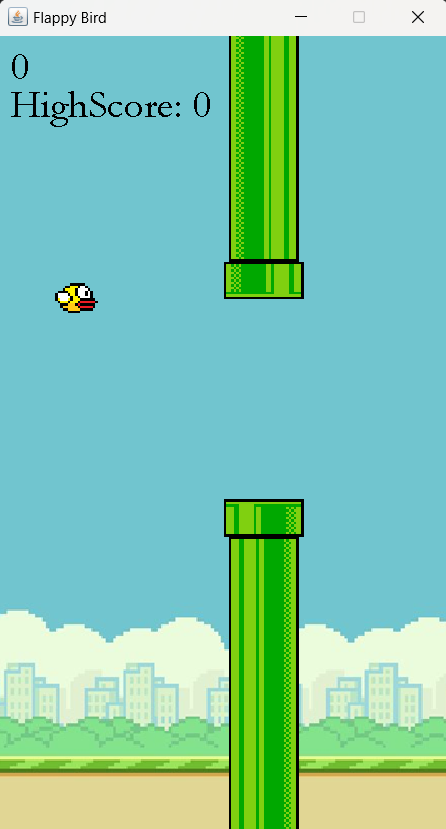

# FlappyBird Java Game
  
A simple clone of the popular game Flappy Bird built using Java and Swing for the graphical interface.  The objective of the game is to navigate the bird through gaps between pipes by pressing the spacebar to keep the bird from falling or crashing into the pipes. 

## Game Screenshot

